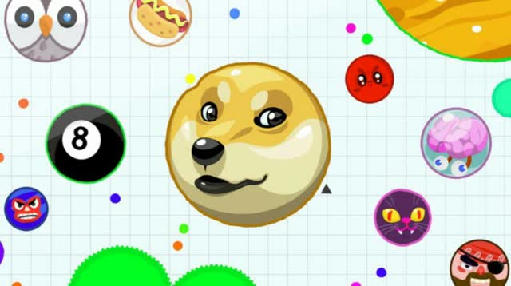

# Thu Jul 20 19:24:51 PDT 2023

I created a directory to store all the bots and I have come up with a naming scheme that I feel will be helpful.

> architecture_greekLetter_digits.py

`cnn_alpha_0`: will be the simplest cnn model. I will take in a screenshot and spit out the mouse position in the next second.

`cnn_beta_0`: will take in screenshot and mouse position.

`cnn_gamma_0`: will take in screenshot, mouse position, and velocity.

You get the idea. When I start mixing in reinforcement learning I'll name things like `tdq_alpha_0` and `tdq_beta_0` and `tdq_gamma_0` etc.

---
> endlog - Thu Jul 20 19:49:09 PDT 2023

## Thu Jul 20 15:07:18 PDT 2023

## Thoughts on the first CNN bot

This bot is going to be an imitation learning bot. It learns as the player plays the game. Then the player lets the bot play by itself and watches to see how well the bot plays. I'd like for the player to see the bots ability even before the bot takes control.

* While the bot it not playing it should project a dot to show where it would play if it was allowed to play.

* Also keep the first CNN bot simple no need to track mouse velocities and stuff.

---
> endlog - Thu Jul 20 15:15:23 PDT 2023

## Tue Jul 18 07:15:13 PDT 2023

I tried taking separation of responsibilities as far as I reasonably could. At the start of agario_bot.py `makeBot` holds the function to create a new bot on its run. Then there are 5 function that lead create the control flow of the program.

```md
          [Bot gets created]
                 |
                 V
main() ==>  startGame() ==> pausablyPlayGame() <==\
                                \\         \\     \\
                                 \\         \==> pauseBot()
                                  \\
                                   \==> playGame(stop_signal)
```

With this I think I have a decent environment to start messing with different kinds of models. For now I've made random_bot that moves the cursor randomly. I should make more bots following the template of [random_bot](random_bot.py).

Also since the bot get created just before the game starts, the bot can create a thread and start observing the game on its own. Then when its called on to play it can play and know that any observations made while it is playing are actions taken by itself, while any observations made while it is not playing are actions taken by the player (ie. actions to be learned from).

---
> endlog - Tue Jul 18 07:34:37 PDT 2023

## Tue Jul 18 05:42:38 PDT 2023

I think I just got pointers in python. If I want to keep track of a value I can assign a variable to hold that value. Then when the value changes I update that variable. If I use this variable to share the value with another variable, then update the original variable, the update is not reflected across to the other variable. I would like to use this ability with threads. I want one thread to be able to tell the other thread to stop.

I just realized and tested with [threadtest.py](threadtest.py) that if I assign an array to the variable and share the array with other variables then changes to the array are carried through.

---
> endlog - Tue Jul 18 05:47:51 PDT 2023

## Tue Jul 18 03:09:52 PDT 2023

I asked chatgpt to help me make the python bot. With its guidance I created a new anaconda virtual environment on windows. (I used to do all my anaconda stuff on wsl). Anyways I got a simple bot running using pyautogui that plays randomly.


I did have some trouble getting the `pyautogui.locate` function to work but it got resolved on updating pillow. Thanks [Stackoverflow](https://stackoverflow.com/a/68523915/6878479)

---
> endlog - Tue Jul 18 03:20:15 PDT 2023

## Thu Jul 13 16:25:01 PDT 2023

Ok here's an idea. This will definately generate data of the mouse being controlled by a program and the mouse being controlled by a human.

There is an avanue for cybersecurity research here. Specifically in biometric identity. How good can the program emulate the biometric identiy of the person. Could a biometric mask be developed to put on the program's control of the mouse.

---
> endlog - Thu Jul 13 16:30:41 PDT 2023

## Thu Jul 13 14:00:55 PDT 2023

Agar.io is a fun and addicting multiplayer online game with a simple enough rule and control set that I want to try and train a model to play it. More specifically I want to try and develop an approach where humans can guide the model on it path to learning the game the way a human would guide another.



Here's the basic [wikihow](https://www.wikihow.com/Play-Agar.io)

The approach I'm thinking of is to is to have a program running the controls when the player is passive. The player will be watching as the program plays and will be free to intervene and play themselves. When they do the program will sit back, watch, and learn from the players game play.

Here are a few bullet points I'd like to see in this project

* A way to see why the program makes certain decision based on the visible game state
* A way to see how confident the program is with each decision it makes
* A way to tell the program it did something really well just right now
* A way to tell the program it did something terrible just right now

---

Here's an idea. I really like the idea of activating the drop out layers even in prediction so that confidence can be determined by how similar the outputs from each slightly different dropped out neural network is. I want to try to use this as an approach to train simpler neural networks as RL agents.

> If an action proves to be good reinforce by training multiple dropout variations for the same action
>
> If an action proves to be bad reinforce by training multiple dropout variation against the same action

  This idea is based on speculation so read the original paper before sinking effort into this

---

## Starting point

`pyautogui` looks like a decent starting point. According to ChatGPT it "is a Python library that provides cross-platform support for controlling the mouse and keyboard. It allows you to automate GUI interactions, such as moving the mouse, clicking, scrolling, and typing". I should check out its [Documentation](https://pyautogui.readthedocs.io/en/latest/)

Remember what Jeremy Howard said. When it comes to AI models start with a really stupid simple model and build up from there. Don't get vexed by trying to make things perfect with the library, and neural networks.

The simplest model I can think of right now is a model that does not even look at the screen but just randomly puts inputs. Maybe start from there. Just get the peripherals to work so that the program is able to input some controls when the user is passive and relinquish controls when the user is active.

---
> endlog - Thu Jul 13 14:56:25 PDT 2023
